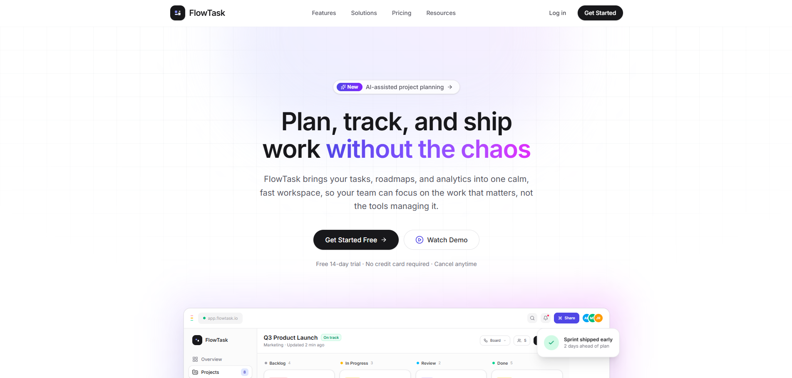

# FlowTask — Landing page



Landing page moderne, professionnelle et entièrement responsive pour la plateforme SaaS de gestion de projet **FlowTask**.

Développée avec **Next.js (App Router)**, **TypeScript**, **Tailwind CSS v4**, **Lucide React** et **Framer Motion**.

> Version anglaise : [README.en.md](./README.en.md)

---

## ✨ Aperçu

Une landing page de qualité « production » pensée comme un vrai produit SaaS :

- **Navbar responsive** — logo, liens de navigation, CTA, menu mobile animé
- **Hero** — accroche forte, double CTA, mockup du dashboard
- **Entreprises** — bandeau défilant (marquee) des clients
- **Fonctionnalités** — 6 cartes (tâches, collaboration, analytics, automatisation, notifications, intégrations)
- **Démo interactive** — onglets Board / Analytics / Automation avec mockups de dashboard
- **Workflow** — 4 étapes (créer un projet, assigner les tâches, suivre, analyser)
- **Intégrations** — 8 outils (GitHub, Slack, Figma, Google Drive, Jira, Notion, Zoom, Loom)
- **Statistiques** — compteurs animés au scroll
- **Témoignages** — 6 avis clients avec notation
- **Tarifs** — 3 plans avec bascule mensuel / annuel
- **FAQ** — accordéon interactif
- **CTA final + Footer** — avec lien GitHub

## 🛠️ Stack technique

| Outil | Rôle |
| --- | --- |
| [Next.js 16](https://nextjs.org) | Framework React (App Router) |
| [TypeScript](https://www.typescriptlang.org) | Typage statique |
| [Tailwind CSS v4](https://tailwindcss.com) | Styles utilitaires |
| [Lucide React](https://lucide.dev) | Icônes |
| [Framer Motion](https://www.framer.com/motion) | Animations subtiles |

## 📦 Installation

### Prérequis

- **Node.js** 20.9.0 ou plus récent (recommandé : la dernière version LTS)
- **npm**, **pnpm** ou **yarn**

### 1. Récupérer le projet

```bash
git clone https://github.com/neylorxt/flow-task.git
cd flow-task
```

### 2. Installer les dépendances

```bash
npm install
# ou
pnpm install
# ou
yarn install
```

### 3. Lancer le serveur de développement

```bash
npm run dev
```

Ouvrez [http://localhost:3000](http://localhost:3000) dans votre navigateur.
Le hot reload est activé : la page se met à jour automatiquement quand vous modifiez les fichiers.

## 🏗️ Structure du projet

```
flow-task/
├── app/
│   ├── globals.css        # Thème, couleurs de marque, animations
│   ├── layout.tsx         # Layout racine (polices, métadonnées SEO)
│   └── page.tsx           # Composition de toutes les sections
├── components/
│   ├── ui/                # Primitives réutilisables
│   │   ├── Button.tsx
│   │   ├── Container.tsx
│   │   └── FadeIn.tsx     # Animation d'entrée + SectionHeading
│   ├── Navbar.tsx
│   ├── Hero.tsx
│   ├── TrustedBy.tsx
│   ├── Features.tsx
│   ├── Showcase.tsx       # Onglets interactifs (démo produit)
│   ├── Workflow.tsx
│   ├── Integrations.tsx
│   ├── Stats.tsx          # Compteurs animés
│   ├── Testimonials.tsx
│   ├── Pricing.tsx
│   ├── FAQ.tsx
│   ├── FinalCTA.tsx
│   ├── Footer.tsx
│   ├── Logo.tsx
│   └── DashboardMockup.tsx  # Mockup réutilisable (3 vues)
└── package.json
```

Chaque section est un composant isolé et réutilisable : le contenu de la page est composé dans `app/page.tsx`.

## 🔧 Scripts disponibles

| Commande | Description |
| --- | --- |
| `npm run dev` | Lance le serveur de développement |
| `npm run build` | Crée la version de production optimisée |
| `npm start` | Sert la version de production (après `build`) |
| `npm run lint` | Vérifie le code avec ESLint |

## 🎨 Personnalisation

- **Couleur de marque** : le dégradé violet/indigo est défini dans `app/globals.css` (variable `--color-brand-*`) et utilisé via les classes `bg-brand-*` / `text-brand-*`.
- **Contenu** : chaque section (`Features`, `Testimonials`, `Pricing`, `FAQ`, etc.) expose ses données sous forme de tableaux en tête de fichier — modifiez-les sans toucher au JSX.
- **Polices** : la police Inter est chargée dans `app/layout.tsx` via `next/font`.

## 🚀 Déploiement

La façon la plus simple est de déployer sur [Vercel](https://vercel.com) :

1. Importez le dépôt GitHub dans Vercel.
2. Vercel détecte automatiquement Next.js (aucune configuration requise).
3. Déployez.

Vous pouvez aussi utiliser toute plateforme supportant Next.js (Netlify, Cloudflare Pages, Node.js / Docker, etc.).

## 📄 Licence

Ce projet est fourni à titre de démonstration. Toutes les marques et noms de produits cités appartiennent à leurs propriétaires respectifs.
